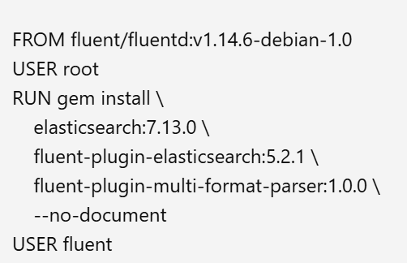
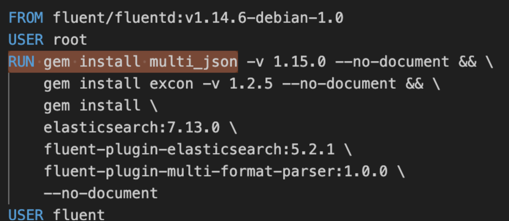
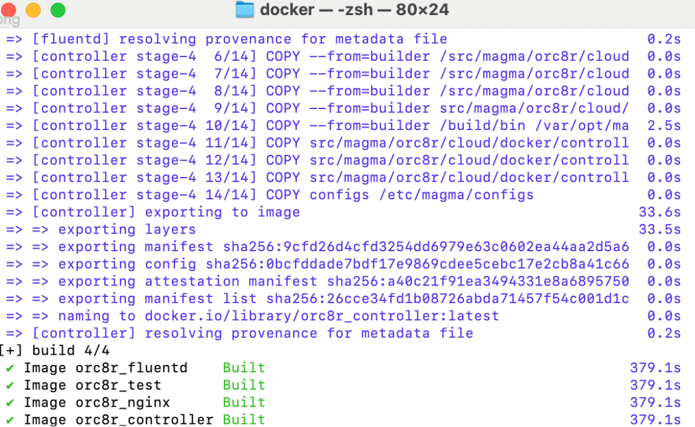
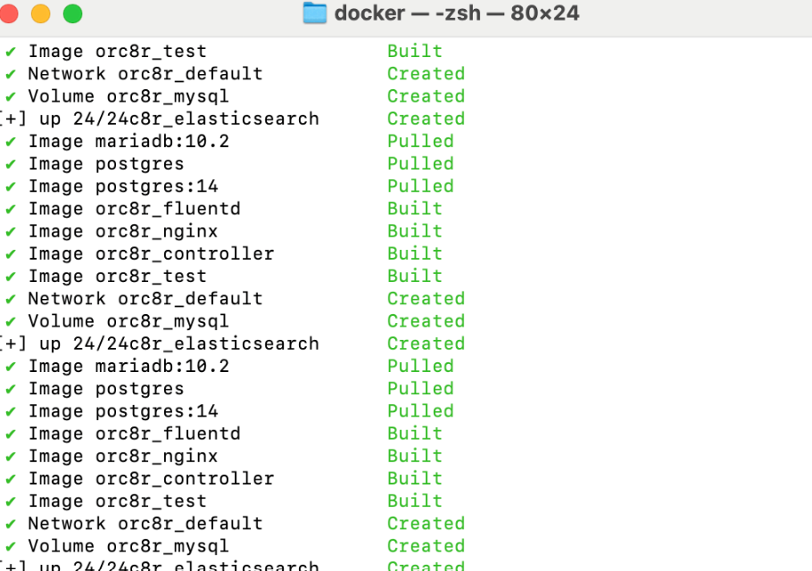

<h1> About Magma </h1>
Magma is an open-source software platform that gives network operators a better way to manage connections, subscribers and services. Cellular networks can be difficult to setup and expensive to maintain but Magma aims to change this by helping companies deploy cellular networks. It is a converged core supporting lte, 5g and wifi. It has 3 main components
<ol>
<li> Orchestrator
<li> NMS or Network Management System
<li> Access Gateway (AGW)
</ol> 
You can learn more about the components <a href="https://www.youtube.com/watch?v=59U5mL6saXs"> here </a>.  
Keep in mind, orchestrator and nms can be setup on the same machine whereas the AGW has to be setup on a separate machine/VM. First, we will walk through setting up NMS + orchestrator :)
Before getting started, these were some resources I referred to- a mix of official docs and past contributor's guides. (as of Feb 2026, the official docs could be outdated and the docker based deployment is recommended to be the easiest one).
<ol>
<li> Official docs
<li> Lani's guide
<li> Kidus' guide
</ol>
This guide uses <b> DOCKER-BASED </b> deployment.  
<h1> Prerequisites for the setup </h1>
Some important points to note-
<ol>
<li> A windows OS is currently not supported as the developing enviroment due to some linux only tools during setup. However, there are workarounds such as WSL, dual booting your system or a VM. Personally I would prefer a VM (as my AGW system did not have much RAM) and there are tools such as <a href = "https://www.virtualbox.org/">VirtualBox</a> that help you setup a VM quite easily! Your choice should be based on the compute and storage power of your system.
<li> It is recommended to keep nms+orchestrator on one system and agw on a separate one. This can even be done with 2 separate Linux VMs.
<li> For my setup, my orchestrator and nms used macOS whereas I had AGW running on a Linux VM.
<li> Go ahead and install <a href = "docker.com">docker</a> and docker compose.
<li> Ensure you have git.
</ol>

<h1> Getting started with orchestrator + NMS </h1>
<ol>
<li> Clone the Magma repository. 
<code> git clone https://github.com/magma/magma.git  
cd magma</code>
<li> Build the orchestrator docker containers. Navigate to the orc8r directory on your machine. <code> cd orc8r/cloud/docker </code>. Once you're in that path, run <code> ./build.py --all </code> This builds all docker images for the orchestrator.
<li> Once the orchestrator build is completed, we can start the orchestrator cloud using <code> ./run.py </code>  
<blockquote> At this point I encountered an error, so let us dive into how I debugged it!
Error in running orchestrator step i.e ./run.py
 failed to solve: process "/bin/sh -c gem install     elasticsearch:7.13.0     fluent-plugin-elasticsearch:5.2.1     fluent-plugin-multi-format-parser:1.0.0     --no-document" did not complete successfully: exit code: 1

--------------------

  13 |     USER root

  14 | >>> RUN gem install \

  15 | >>>     elasticsearch:7.13.0 \

  16 | >>>     fluent-plugin-elasticsearch:5.2.1 \

  17 | >>>     fluent-plugin-multi-format-parser:1.0.0 \

  18 | >>>     --no-document

  19 |     USER fluent

--------------------

target fluentd: failed to solve: process "/bin/sh -c gem install     elasticsearch:7.13.0     fluent-plugin-elasticsearch:5.2.1     fluent-plugin-multi-format-parser:1.0.0     --no-document" did not complete successfully: exit code: 1  
In my case, there were two incompatible gems, excon and multi-json (incompatible with ruby 2.7). So I had to pin both their versions. A quick search in vscode revealed two files <code> orc8r/cloud/docker/fluentd_forward/dockerfile </code> and <code> orc8r/cloud/docker/fluentd/dockerfile </code> contained these lines: 

Changing this to:  
 resolved the error.
 </blockquote>
Once the orchestrator is successfully built and you run ./run.py, you should see something like this:

</ol>
Yay! the orchestrator has been setup.  
<h1> Setting up NMS </h1>

