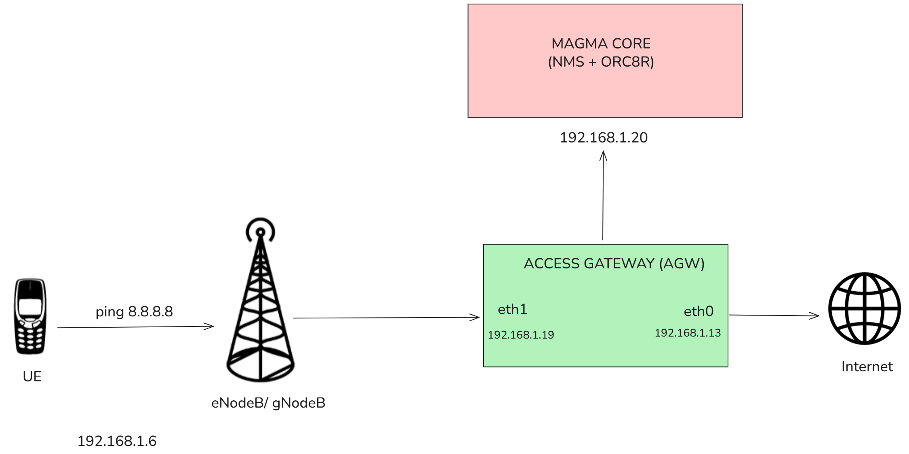
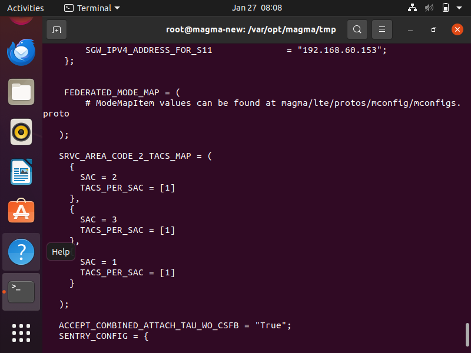

<h1> Packet Testing Magma with UERANSIM</h1>This tutorial explains packet testing with the Magma core network using <a href =https://github.com/aligungr/UERANSIM/wiki>UERANSIM</a>. I use the docker based deployment of Magma. UERANSIM simulates both the gNodeB and UE. Once UE is registered, it can send traffic to internet through Magma core. Before getting started, it is important to note UERANSIM should be run on <b>Linux</b> and Windows is not supported since Microsoft did not implement the SCTP protocol. Also, the system running UERANSIM should not be same as AGW.   

 
<h1> Some Terminologies </h1>
<h3> PCAP </h3>
PCAP is a file format (packet capture) used to store live network traffic data allowing devs to analyse specific packets and protocols using tools like Wireshark.
<h3> UE </h3>
UE or User Equipment is any device used directly by an end-user to communicate such as a smart phone or an IOT module which connects to an LTE/5G network.
<h3> eNodeB </h3>
eNodeB/ gNodeB is the hardware in the LTE network that communicates wirelessly witht he UE and acts as the bridge to the core network. It is the base station or cell tower.
<h3> tcpdump </h3>
A powerful command-line packet analyser tool used to intercept and display TCP/IP and other packets being transmitted or received over a network.<h2>Step 1: Set up UERANSIM</h2>
<ol>
<li> Create a new VM to install UERANSIM which is supposed to create a simulated UE as well as eNodeB.
<li> <code> sudo apt update  
sudo apt install make gcc g++ libsctp-dev lksctp-tools iproute2  
sudo snap install cmake --classic</code>   If successful, the message <b>UERANSIM successfuly built </b> will be displayed.
</ol>
<h2> Step 2: Configuration </h2>
This step involves setting up the UE and gnb config files for Magma.
<ol>
<li> Navigate to UERANSIM directory. <code> cd UERANSIM </code>
<li> <code> cd config </code>
Here, a quick <code> ls </code> shows multiple config files are available. Edit any one of them.
<li> <code> nano open5gs-gnb.yaml </code> and then <code> nano open5gs-ue.yaml </code> 
The configs I referred to can be found <a href=https://github.com/jordanvrtanoski/UERANSIM/tree/master/magma> here </a>.   
<blockquote> The IP values in the GNB config file have to be edited according to the IP of the AGW and the system running UERANSIM! The rest of the values can remain the same.  
In the gnb config 
<code>ngapIp: IP of system running UERANSIM  
gtpIp: IP of system running UERANSIM 
amfConfigs: 
-address: IP of AGW system </code> 
A simple ip -br addr in the terminal should help you find this.
</blockquote> </ol>
<h2> Step 3: Register a Subscriber </h2>
<ol><li> In the NMS UI sidebar, go to subscribers
<li> Click on add subscriber.
<li> <b> The details you enter here should match with the UE config.  Such as IMSI, Auth key and OPC or operator code. </b> You also have to create an APN (Access Point Name) in the NMS UI. Go to Traffic -> APNs and create a new APN. You can leave the default configurations here and attach this APN to your subscriber. 

</b>   
<blockquote>
<ul><li> IMSI- International Mobile Subscriber Identity is a unique 15 digit number stored on the SIM card that identifies a specific user on a cellular network.
<li> Authentication Key (K): A 128-bit secret value unique to each SIM card used to verify the subscriber's identity and encrypt communication between phone and network.
<li> OPC: Operator code is derived from authentication key and operator key used specifically in the 4G/5G authentication process to verify that SIM and network belong to the same provider.
</ul>
 </blockquote>
For more details on managing subscribers, you can refer to <a href=https://magma.github.io/magma/docs/nms/subscriber#subscriber-configuration> Magma docs </a>
</ol>
<h2>Step 4: Execution</h2>
<ol>
<li> Ensure the AGW is up and running. In the AGW machine, enter
<code> sudo tcpdump -i any -w magma_traffic.pcap </code> to capture all network packets on the machine and saves them to a file. Alternatively, to listen on specific network interfaces use <code> sudo tcpdump -i eth0 -w eth0_traffic.pcap </code> and <code> sudo tcpdump -i eth1 -w eth1_traffic.pcap </code>.
<li> On the UERANSIM machine, start the gNB followed by the UE. From UERANSIM directory <code> ./build/nr-gnb -c config/open5gs-gnb.yaml </code>
<li> In another terminal, navigate to UERANSIM directory and run <code>./build/nr-ue -c config/open5gs-ue.yaml </code>
<li> Now you can use the <code> ping 8.8.8.8 </code> command to capture network traffic into the pcap file for later analysis. You can also use <code> curl https://example.com</code> to capture a full HTTPS handshake and data exchange in a pcap file. <code> Ctrl + C </code> to stop the command.   
<h5> gnb terminal </h5>

<h5> UE terminal </h5>

<h2>Step 5: Download pcap files</h2>
In my case, the pcap files were downloaded in /var/opt/magma directories which are not directly accessible. So, I started a simple Python server to download these files.
<ol>
<li> Navigate to the directory which contains the pcap files with <code> cd directory_name </code>
<li> Start the server <code>python3 -m http.server 8000 </code> and follow the http link. You can download the files from here.
</ol> 

<h2> Step 6: Wireshark Analysis </h2>
Wireshark lets you analyse the captured pcap files.
<ol>
<li> <a href = https://www.wireshark.org/download.html> Download Wireshark </a>.
<li> Open the relevant pcap files in Wireshark.
<li> In the filters section, apply filters such as SCTP and look for the IP addresses of your AGW, UE and Magma network.
</ol>

<h2> Troubleshooting </h2>
<ul>

<li> In the event of SCTP Connection Failure from gnb terminal, ensure 5G feature is enabled from Swagger UI.
<li> <code>cat /proc/net/sctp/eps</code> should shows two active ports <code> 36412 </code> and <code> 38412 </code>. 
<li> Refer to <a href = https://magma.github.io/magma/docs/lte/integrated_5g_sa#test-and-troubleshooting>Magma docs</a> for more information related to enabling 5G and troubleshooting.
</ul>
<h3> oai_mme container infinite restart </h3>
<ol>
<li> At times <code> docker ps | grep magma </code> shows the container is stuck on infinite restart. This may point to an error in the config files- gateway.mconfig or mme.conf generated by magmad.
<li> In my case, it was due to <code> serviceAreaMap </code> being configured with values such as <code> additionalProp1 </code>. This caused a parsing error. Changing this to a numeric value as shown below, ensured mme funtionality and both ports <code> 36412 </code> and <code> 38412 </code> started to show up.  

